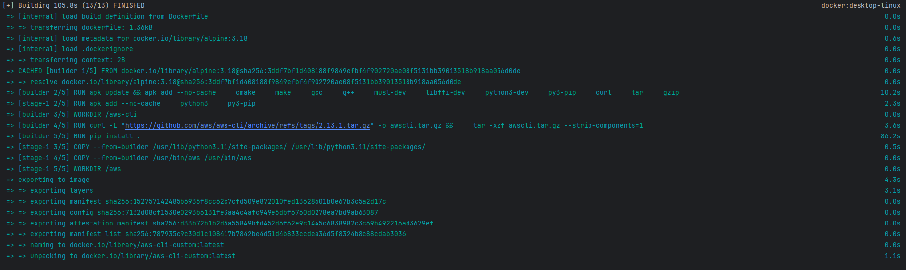
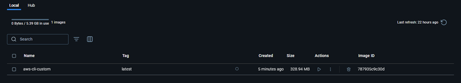

# Docker_EKS_LSC


## TASK 1: Docker
Dockerize AWS-CLI (3p) 
a) Create a Dockerfile with aws-cli, built from source files (using tar.gz file / make).
* Use a multi-stage build to create a small image. Also use a small base image, e.g., based on Alpine Linux. 
* Read more on Python and Docker multistage build.
* Follow best practices for writing Dockerfiles. In particular read about ADD or COPY. 

b) Build an image based on your Dockerfile and test it.  
* Use a volume (-v option) to make AWS credentials available in the container. 

---

The Dockerfile implements multi-stage build to separate build environment from runtime environment, which significantly reduces final image size. 

Layer optimization is achieved by combining RUN commands and using --no-cache flag. Security is enhanced by including only minimal runtime dependencies and removing build tools from the final image. 

Build reproducibility is ensured by using specific version tags for base images and fixed AWS CLI version.

```dockerfile
# Stage 1: Build
# Using Alpine for minimal size and fast build
FROM alpine:3.18 AS builder

# Install build dependencies in a single layer
# Note: Combined commands reduce image layers
RUN apk update && apk add --no-cache \
    cmake \
    make \
    gcc \
    g++ \
    musl-dev \
    libffi-dev \
    python3-dev \
    py3-pip \
    curl \
    tar \
    gzip

# Set up build directory
WORKDIR /aws-cli

# Download and extract AWS CLI source
# Note: Using specific version for reproducibility
RUN curl -L "https://github.com/aws/aws-cli/archive/refs/tags/2.13.1.tar.gz" -o awscli.tar.gz && \
    tar -xzf awscli.tar.gz --strip-components=1

# Install AWS CLI
RUN pip install .

# Stage 2: Image
# Using clean Alpine for smallest possible footprint
FROM alpine:3.18

# Install runtime dependencies
# Note: Only essential packages for AWS CLI operation
RUN apk add --no-cache \
    python3 \
    py3-pip

# Copy AWS CLI from builder stage
# Note: Copy only necessary files
COPY --from=builder /usr/lib/python3.11/site-packages/ /usr/lib/python3.11/site-packages/
COPY --from=builder /usr/bin/aws /usr/bin/aws

# Set working directory for AWS operations
WORKDIR /aws

# Configure container startup command
ENTRYPOINT ["aws"]
```

To run the container with your AWS credentials (currently using Docker version 27.3.1):

```bash
docker build -t aws-cli-custom .
```






```bash
docker run --rm aws-cli-custom –version

docker run --rm -v ${HOME}\.aws:/root/.aws aws-cli-custom s3 ls
```

AWS CLI Docker container was successfully built (version 2.13.1) and tested, confirming proper installation and functionality. 

The container successfully connected to AWS services, demonstrating correct credentials mounting by listing an S3 bucket (lab3-lsc), validating both local operation and AWS connectivity.


## TASK 2: Kubernetes
a)	Create a k8s cluster using Amazon Elastic Kubernetes Service (EKS)
* You can also use minikube, kind, or any other Kubernetes distribution, or existing cluster.
* Minikube, by default, uses its own internal Docker daemon. This daemon doesn’t know anything about images built previously. Prepare your environment by directing it to access the internal docker daemon by using the $(minikube docker-env) command and rebuild your images. This way images will be available within the k8s cluster. (https://medium.com/bb-tutorials-and-thoughts/how-to-use-own-local-doker-images-with-minikube-2c1ed0b0968)

b)	Using Helm, install an NFS server and provisioner in the cluster.
* Go to charts/nfs-server-provisioner for a README.
* Pay attention to configuration parameters, in particular, override storageClass.name which denotes the name of the StorageClass that you’ll have to use when creating Persistent Volume Claims.

c)	Create a Persistent Volume Claim which will bind to a NFS Persistent Volume provisioned dynamically by the provisioner installed in the previous step.

d)	Create a Deployment with a HTTP server (e.g., apache or nginx). The web content directory should be mounted as a volume using the PVC created in the previous step.

e)	Create a Service associated with the Pod(s) of the HTTP server Deployment.

f)	Create a Job which mounts the PVC and copies a sample content through the shared NFS PV.Test the HTTP server by showing the sample web content in a browser.

---


